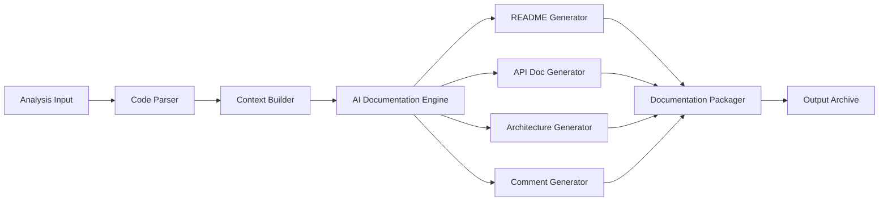

# Design Document

## Overview

The Documentation Generator is an AI-powered system that transforms undocumented legacy code into comprehensive, readable documentation. It leverages the analysis results from the Codebase Analysis Engine and uses language models to generate natural language descriptions of code functionality. The system produces multiple documentation artifacts including README files, API documentation, architecture overviews, and inline code comments.

## Architecture

The Documentation Generator follows a multi-stage pipeline architecture:



### Key Architectural Decisions

1. **AI-Powered Generation**: Use language models (GPT-4, Claude) to generate natural language documentation
2. **Context-Aware**: Leverage analysis results to provide rich context to the AI
3. **Modular Generators**: Separate generators for each documentation type allow independent execution
4. **Template-Based**: Use customizable templates to ensure consistent formatting
5. **Incremental Processing**: Process files incrementally to manage memory and enable progress tracking

## Components and Interfaces

### 1. Code Parser

**Responsibility**: Parse source code to extract structural information for documentation

**Interface**:
```typescript
interface CodeParser {
  parseFile(filePath: string, language: string): Promise<ParsedCode>
  extractFunctions(code: ParsedCode): FunctionInfo[]
  extractClasses(code: ParsedCode): ClassInfo[]
  extractAPIs(code: ParsedCode): APIEndpoint[]
  extractImports(code: ParsedCode): ImportInfo[]
}

interface ParsedCode {
  ast: any // Abstract Syntax Tree
  language: string
  filePath: string
}

interface FunctionInfo {
  name: string
  parameters: Parameter[]
  returnType: string | null
  body: string
  lineNumber: number
  docstring?: string
}

interface ClassInfo {
  name: string
  methods: FunctionInfo[]
  properties: PropertyInfo[]
  extends: string | null
  implements: string[]
}

interface APIEndpoint {
  method: string // GET, POST, etc.
  path: string
  handler: string
  parameters: Parameter[]
  requestBody?: SchemaInfo
  responses: ResponseInfo[]
}
```

### 2. Context Builder

**Responsibility**: Build rich context from analysis results and code structure

**Interface**:
```typescript
interface ContextBuilder {
  buildProjectContext(analysisReport: AnalysisReport, codebase: string): ProjectContext
  buildFileContext(file: string, projectContext: ProjectContext): FileContext
  buildFunctionContext(func: FunctionInfo, fileContext: FileContext): FunctionContext
}

interface ProjectContext {
  name: string
  languages: string[]
  frameworks: string[]
  dependencies: Dependency[]
  structure: DirectoryTree
  metrics: CodeMetrics
  mainEntryPoints: string[]
}

interface FileContext {
  filePath: string
  purpose: string // Inferred from analysis
  imports: ImportInfo[]
  exports: ExportInfo[]
  relatedFiles: string[]
}

interface FunctionContext {
  function: FunctionInfo
  callers: string[]
  callees: string[]
  usedVariables: string[]
  sideEffects: string[]
}
```

### 3. AI Documentation Engine

**Responsibility**: Generate natural language documentation using AI models

**Interface**:
```typescript
interface AIDocumentationEngine {
  generateDescription(context: any, type: 'function' | 'class' | 'module'): Promise<string>
  generateSummary(codebase: ProjectContext): Promise<string>
  generateArchitectureDescription(components: ComponentInfo[]): Promise<string>
  improveExistingDoc(existingDoc: string, context: any): Promise<string>
}

interface AIConfig {
  model: 'gpt-4' | 'claude-3' | 'gpt-3.5-turbo'
  temperature: number
  maxTokens: number
  systemPrompt: string
}
```

### 4. README Generator

**Responsibility**: Generate comprehensive README.md files

**Interface**:
```typescript
interface READMEGenerator {
  generate(projectContext: ProjectContext): Promise<string>
  generateTitle(projectContext: ProjectContext): string
  generateDescription(projectContext: ProjectContext): Promise<string>
  generateInstallation(dependencies: Dependency[]): string
  generateUsage(entryPoints: string[]): Promise<string>
  generateProjectStructure(structure: DirectoryTree): string
}
```

### 5. API Documentation Generator

**Responsibility**: Generate API endpoint documentation

**Interface**:
```typescript
interface APIDocGenerator {
  generate(endpoints: APIEndpoint[]): Promise<string>
  generateEndpointDoc(endpoint: APIEndpoint): Promise<string>
  generateRequestExample(endpoint: APIEndpoint): string
  generateResponseExample(endpoint: APIEndpoint): string
  generateOpenAPISpec(endpoints: APIEndpoint[]): object
}
```

### 6. Architecture Generator

**Responsibility**: Generate architecture overview and diagrams

**Interface**:
```typescript
interface ArchitectureGenerator {
  generate(projectContext: ProjectContext): Promise<ArchitectureDoc>
  identifyComponents(codebase: string): Component[]
  generateComponentDiagram(components: Component[]): string // Mermaid
  generateDataFlowDiagram(components: Component[]): string // Mermaid
  describeArchitecturalPatterns(components: Component[]): Promise<string>
}

interface ArchitectureDoc {
  overview: string
  components: ComponentDescription[]
  diagrams: {
    component: string
    dataFlow: string
  }
  patterns: string[]
}

interface Component {
  name: string
  type: 'service' | 'controller' | 'model' | 'utility'
  files: string[]
  dependencies: string[]
  responsibilities: string[]
}
```

### 7. Comment Generator

**Responsibility**: Generate inline code comments

**Interface**:
```typescript
interface CommentGenerator {
  generateFunctionComment(func: FunctionInfo, context: FunctionContext): Promise<string>
  generateClassComment(cls: ClassInfo): Promise<string>
  generateInlineComments(code: string, language: string): Promise<AnnotatedCode>
  formatComment(comment: string, language: string): string
}

interface AnnotatedCode {
  originalCode: string
  annotatedCode: string
  comments: Array<{
    line: number
    comment: string
  }>
}
```

### 8. Documentation Packager

**Responsibility**: Package all documentation into downloadable formats

**Interface**:
```typescript
interface DocumentationPackager {
  package(docs: DocumentationSet): Promise<PackagedDocs>
  createArchive(docs: DocumentationSet): Promise<Buffer>
  generateManifest(docs: DocumentationSet): Manifest
  convertToHTML(markdownDocs: DocumentationSet): HTMLDocs
}

interface DocumentationSet {
  readme: string
  api?: string
  architecture?: string
  comments: Map<string, AnnotatedCode>
  metadata: DocumentationMetadata
}

interface PackagedDocs {
  archive: Buffer // ZIP file
  manifest: Manifest
  htmlVersion: HTMLDocs
}
```

## Data Models

### Documentation Metadata
```typescript
interface DocumentationMetadata {
  projectId: string
  generatedAt: Date
  generator: string
  version: string
  options: DocumentationOptions
  statistics: {
    filesDocumented: number
    functionsDocumented: number
    classesDocumented: number
    apiEndpointsDocumented: number
  }
}
```

### Documentation Options
```typescript
interface DocumentationOptions {
  types: ('readme' | 'api' | 'architecture' | 'comments')[]
  depth: 'minimal' | 'standard' | 'comprehensive'
  excludePaths: string[]
  customTemplates?: Map<string, string>
  mergeExisting: boolean
}
```

## Correctness Properties

*A property is a characteristic or behavior that should hold true across all valid executions of a system-essentially, a formal statement about what the system should do. Properties serve as the bridge between human-readable specifications and machine-verifiable correctness guarantees.*


### Property Reflection

After reviewing all testable properties, several can be consolidated:
- Properties 1.2, 1.3, 1.4 (README content sections) can be combined into a single README completeness property
- Properties 2.1, 2.2, 2.3 (function documentation elements) can be combined into a single function documentation completeness property
- Properties 4.2, 4.3, 4.4, 4.5 (API endpoint documentation elements) can be combined into a single endpoint documentation completeness property
- Properties 5.3 and 5.5 (terminology consistency and reference validation) both relate to documentation correctness and can be combined
- Properties 8.2 and 8.3 (directory structure and manifest) both relate to package organization and can be combined

### Property 1: README file generation
*For any* processed codebase, a README.md file should be created in valid markdown format.
**Validates: Requirements 1.1**

### Property 2: README content completeness
*For any* generated README, it should contain all required sections: title, description, detected technologies/frameworks, and project structure.
**Validates: Requirements 1.2, 1.3, 1.4**

### Property 3: Installation instructions presence
*For any* codebase with detected dependencies, the generated README should include installation instructions.
**Validates: Requirements 1.5**

### Property 4: Function documentation completeness
*For any* documented function, the documentation should include a purpose description, all parameters with types and descriptions, and return value with type and description.
**Validates: Requirements 2.1, 2.2, 2.3**

### Property 5: Class documentation completeness
*For any* documented class, the documentation should include the class purpose and documentation for all public methods.
**Validates: Requirements 2.4**

### Property 6: Language-appropriate documentation format
*For any* generated code documentation, the format should match the language conventions (JSDoc for JavaScript, docstrings for Python, XML comments for C#, etc.).
**Validates: Requirements 2.5**

### Property 7: Architecture file generation
*For any* processed codebase, an architecture.md file should be created describing the system structure.
**Validates: Requirements 3.1**

### Property 8: Component documentation completeness
*For any* system with multiple detected components, each component should have its responsibility described in the architecture documentation.
**Validates: Requirements 3.2**

### Property 9: Mermaid diagram generation
*For any* architecture documentation, a valid Mermaid diagram showing component relationships should be included.
**Validates: Requirements 3.3**

### Property 10: Data flow documentation
*For any* system with detectable data flow patterns, the data flow between components should be documented in the architecture file.
**Validates: Requirements 3.4**

### Property 11: Architectural pattern identification
*For any* codebase using recognizable architectural patterns, those patterns should be identified and documented.
**Validates: Requirements 3.5**

### Property 12: API documentation file generation
*For any* codebase with detected API endpoints, an api.md file should be created.
**Validates: Requirements 4.1**

### Property 13: API endpoint documentation completeness
*For any* documented API endpoint, the documentation should include HTTP method, path, request parameters/body schema, response formats/status codes, and example requests/responses.
**Validates: Requirements 4.2, 4.3, 4.4, 4.5**

### Property 14: Documentation accuracy
*For any* generated documentation, all documented code elements should exist in the actual codebase (no hallucinated elements).
**Validates: Requirements 5.1, 5.5**

### Property 15: Documentation update consistency
*For any* codebase that is modified and re-documented, the new documentation should reflect the changes made to the code.
**Validates: Requirements 5.2**

### Property 16: Terminology consistency
*For any* documentation set, the same code elements should be referred to with consistent names across all documentation files.
**Validates: Requirements 5.3**

### Property 17: Uncertainty marking
*For any* documentation with uncertain or inferred information, those sections should be explicitly marked as "inferred" or "needs verification".
**Validates: Requirements 5.4**

### Property 18: Configuration option respect
*For any* documentation generation with specified options, only the requested documentation types should be generated.
**Validates: Requirements 6.1**

### Property 19: Documentation depth control
*For any* two documentation generations at different depth levels (minimal vs comprehensive), the comprehensive version should contain more detail than the minimal version.
**Validates: Requirements 6.2**

### Property 20: Exclusion pattern respect
*For any* documentation generation with specified exclusion patterns, files and directories matching those patterns should not appear in the generated documentation.
**Validates: Requirements 6.3**

### Property 21: Custom template application
*For any* documentation generation with custom templates, the generated documentation should follow the structure and format specified in the templates.
**Validates: Requirements 6.4**

### Property 22: Existing documentation handling
*For any* codebase with existing documentation, the generator should correctly apply the specified merge or replace strategy.
**Validates: Requirements 6.5**

### Property 23: File failure resilience
*For any* documentation generation where one file fails to process, the remaining files should still be successfully documented.
**Validates: Requirements 7.3**

### Property 24: Progress update emission
*For any* documentation generation process, progress updates should be emitted at regular intervals.
**Validates: Requirements 7.4**

### Property 25: Caching effectiveness
*For any* repeated documentation generation of the same codebase, the second generation should use cached results and complete faster than the first.
**Validates: Requirements 7.5**

### Property 26: Documentation packaging
*For any* generated documentation set, all files should be packaged into a valid downloadable archive.
**Validates: Requirements 8.1**

### Property 27: Package organization and manifest
*For any* packaged documentation, it should have a logical directory structure and include a manifest file listing all generated documentation.
**Validates: Requirements 8.2, 8.3**

### Property 28: Format preservation
*For any* packaged and extracted documentation, the markdown formatting and diagrams should be preserved exactly.
**Validates: Requirements 8.4**

### Property 29: Dual format generation
*For any* documentation set, both markdown and HTML versions should be generated, and they should contain equivalent content.
**Validates: Requirements 8.5**

## Error Handling

### Error Categories

1. **Parsing Errors**
   - Unsupported language syntax
   - Malformed code files
   - Missing dependencies for parsing

2. **AI Generation Errors**
   - API rate limits
   - Model timeouts
   - Invalid AI responses

3. **File System Errors**
   - Permission denied
   - Disk space exhausted
   - File not found

4. **Validation Errors**
   - Invalid configuration options
   - Circular dependencies
   - Missing required context

### Error Handling Strategy

1. **Graceful Degradation**: If one documentation type fails, continue generating others
2. **Partial Results**: Save successfully generated documentation even if some parts fail
3. **Retry Logic**: Retry AI API calls with exponential backoff for transient failures
4. **Fallback Templates**: Use template-based generation if AI generation fails
5. **Detailed Error Reporting**: Include specific error messages and affected files in reports

## Testing Strategy

### Unit Testing

The system will use Jest for unit testing with the following focus areas:

1. **Parser Testing**: Test code parsing for various languages and structures
2. **Context Building**: Test context extraction from analysis results
3. **Template Rendering**: Test template-based documentation generation
4. **Format Conversion**: Test markdown to HTML conversion
5. **Packaging**: Test archive creation and manifest generation

### Property-Based Testing

The system will use fast-check for property-based testing. Each property test will run a minimum of 100 iterations.

**Property Test Requirements**:
- Each property-based test must be tagged with: `// Feature: documentation-generator, Property X: [property description]`
- Each correctness property must be implemented by a single property-based test
- Tests should use smart generators for code structures and documentation options

**Key Property Tests**:
1. README generation properties (Properties 1-3)
2. Function and class documentation properties (Properties 4-6)
3. Architecture documentation properties (Properties 7-11)
4. API documentation properties (Properties 12-13)
5. Accuracy and consistency properties (Properties 14-17)
6. Configuration and customization properties (Properties 18-22)
7. Resilience and performance properties (Properties 23-25)
8. Packaging properties (Properties 26-29)

### Integration Testing

1. **End-to-End Generation**: Test complete documentation generation pipeline
2. **AI Integration**: Test with real AI API calls (using test API keys)
3. **Multi-Language**: Test with codebases containing multiple languages
4. **Large Codebases**: Test with real-world open-source projects

## Implementation Notes

### Technology Stack

- **Runtime**: Node.js with TypeScript
- **AI Models**: OpenAI GPT-4, Anthropic Claude-3
- **Code Parsing**: Language-specific parsers (@babel/parser, tree-sitter, etc.)
- **Markdown Processing**: marked, remark
- **HTML Generation**: markdown-it with plugins
- **Diagram Generation**: Mermaid
- **Archive Creation**: archiver (ZIP)
- **Testing**: Jest, fast-check

### AI Prompt Engineering

Effective prompts are crucial for quality documentation:

1. **System Prompts**: Define the role and constraints for the AI
2. **Context Injection**: Provide rich context about code structure and purpose
3. **Few-Shot Examples**: Include examples of good documentation in prompts
4. **Structured Output**: Request specific formats (JSON, markdown sections)
5. **Validation**: Validate AI outputs and retry if malformed

### Performance Optimizations

1. **Parallel Processing**: Generate documentation for multiple files concurrently
2. **Batch AI Requests**: Group multiple small documentation requests into batches
3. **Caching**: Cache AI responses and parsed ASTs
4. **Streaming**: Stream large documentation files to disk rather than holding in memory
5. **Incremental Generation**: Only regenerate documentation for changed files

### Quality Assurance

1. **Readability Scoring**: Use readability metrics to ensure documentation is understandable
2. **Completeness Checks**: Verify all required sections are present
3. **Link Validation**: Ensure all internal links in documentation are valid
4. **Code Example Testing**: Verify code examples in documentation are syntactically correct
5. **Consistency Checks**: Ensure terminology is consistent across all documentation
