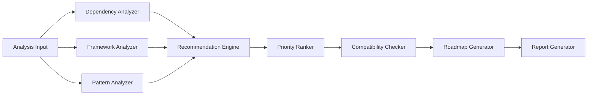

# Design Document

## Overview

The Modernization Advisor is an intelligent system that analyzes legacy codebases to identify modernization opportunities across dependencies, frameworks, and code patterns. It provides actionable, prioritized recommendations with detailed migration guidance, helping teams systematically upgrade their systems while managing risk and effort.

## Architecture

The Modernization Advisor follows a pipeline architecture with analysis, recommendation, and planning stages:



### Key Architectural Decisions

1. **Multi-Source Analysis**: Combine data from package registries, security databases, and code analysis
2. **Rule-Based + AI**: Use rules for objective checks (versions, security) and AI for subjective recommendations (patterns, priorities)
3. **Modular Analyzers**: Separate analyzers for dependencies, frameworks, and patterns allow independent extension
4. **Graph-Based Dependencies**: Model recommendation dependencies as a directed graph for roadmap generation
5. **Caching**: Cache external API calls to package registries and security databases

## Components and Interfaces

### 1. Dependency Analyzer

**Responsibility**: Analyze dependencies to identify outdated versions and security issues

**Interface**:
```typescript
interface DependencyAnalyzer {
  analyzeDependencies(dependencies: Dependency[]): Promise<DependencyAnalysis[]>
  checkLatestVersion(dependency: Dependency): Promise<VersionInfo>
  checkSecurityVulnerabilities(dependency: Dependency): Promise<Vulnerability[]>
  checkDeprecationStatus(dependency: Dependency): Promise<DeprecationInfo>
  categorizeUpdate(current: string, latest: string): UpdateCategory
}

interface DependencyAnalysis {
  dependency: Dependency
  currentVersion: string
  latestVersion: string
  updateCategory: 'major' | 'minor' | 'patch'
  isDeprecated: boolean
  deprecationInfo?: DeprecationInfo
  vulnerabilities: Vulnerability[]
  alternatives?: string[]
}

interface Vulnerability {
  id: string // CVE ID
  severity: 'critical' | 'high' | 'medium' | 'low'
  description: string
  fixedIn: string
}

interface DeprecationInfo {
  isDeprecated: boolean
  deprecationDate?: Date
  alternatives: string[]
  reason: string
}
```

### 2. Framework Analyzer

**Responsibility**: Analyze frameworks to identify upgrade opportunities

**Interface**:
```typescript
interface FrameworkAnalyzer {
  analyzeFrameworks(frameworks: Framework[]): Promise<FrameworkAnalysis[]>
  getLatestVersion(framework: Framework): Promise<string>
  getBreakingChanges(framework: Framework, fromVersion: string, toVersion: string): Promise<BreakingChange[]>
  getMigrationGuide(framework: Framework, fromVersion: string, toVersion: string): Promise<MigrationGuide>
  estimateUpgradeEffort(framework: Framework, breakingChanges: BreakingChange[]): EffortEstimate
}

interface FrameworkAnalysis {
  framework: Framework
  currentVersion: string
  latestVersion: string
  breakingChanges: BreakingChange[]
  migrationGuide: MigrationGuide
  effortEstimate: EffortEstimate
}

interface BreakingChange {
  description: string
  affectedAPIs: string[]
  migrationPath: string
}

interface MigrationGuide {
  url: string
  steps: string[]
  automatedTools: string[]
}

type EffortEstimate = 'low' | 'medium' | 'high'
```

### 3. Pattern Analyzer

**Responsibility**: Identify outdated code patterns and suggest modern alternatives

**Interface**:
```typescript
interface PatternAnalyzer {
  analyzePatterns(codebase: string): Promise<PatternAnalysis[]>
  detectCallbackPatterns(file: string): Promise<PatternMatch[]>
  detectVarDeclarations(file: string): Promise<PatternMatch[]>
  detectClassComponents(file: string): Promise<PatternMatch[]>
  detectDeprecatedFeatures(file: string, language: string): Promise<PatternMatch[]>
  suggestModernAlternative(pattern: PatternMatch): ModernizationSuggestion
}

interface PatternAnalysis {
  pattern: string
  occurrences: PatternMatch[]
  modernAlternative: string
  benefits: string[]
  migrationComplexity: EffortEstimate
}

interface PatternMatch {
  file: string
  line: number
  code: string
  patternType: string
}

interface ModernizationSuggestion {
  description: string
  beforeCode: string
  afterCode: string
  benefits: string[]
}
```

### 4. Recommendation Engine

**Responsibility**: Generate modernization recommendations from analysis results

**Interface**:
```typescript
interface RecommendationEngine {
  generateRecommendations(
    dependencyAnalysis: DependencyAnalysis[],
    frameworkAnalysis: FrameworkAnalysis[],
    patternAnalysis: PatternAnalysis[]
  ): Recommendation[]
  createDependencyRecommendation(analysis: DependencyAnalysis): Recommendation
  createFrameworkRecommendation(analysis: FrameworkAnalysis): Recommendation
  createPatternRecommendation(analysis: PatternAnalysis): Recommendation
}

interface Recommendation {
  id: string
  type: 'dependency' | 'framework' | 'pattern'
  title: string
  description: string
  currentState: string
  suggestedState: string
  benefits: string[]
  effort: EffortEstimate
  priority: Priority
  migrationSteps: string[]
  codeExamples?: {
    before: string
    after: string
  }
  resources: string[]
  automatedTools: string[]
}

type Priority = 'critical' | 'high' | 'medium' | 'low'
```

### 5. Priority Ranker

**Responsibility**: Assign and sort recommendations by priority

**Interface**:
```typescript
interface PriorityRanker {
  rankRecommendations(recommendations: Recommendation[]): Recommendation[]
  calculatePriority(recommendation: Recommendation): Priority
  scoreRecommendation(recommendation: Recommendation): number
}

interface PriorityFactors {
  hasSecurityVulnerability: boolean
  vulnerabilitySeverity?: string
  isDeprecated: boolean
  hasBreakingChanges: boolean
  effortToBenefitRatio: number
  impactScore: number
}
```

### 6. Compatibility Checker

**Responsibility**: Verify compatibility between recommended upgrades

**Interface**:
```typescript
interface CompatibilityChecker {
  checkCompatibility(recommendations: Recommendation[]): CompatibilityReport
  checkDependencyCompatibility(deps: Dependency[]): CompatibilityIssue[]
  checkPeerDependencies(dep: Dependency, version: string): PeerDependencyCheck
  checkLanguageCompatibility(dep: Dependency, version: string, languageVersion: string): boolean
  resolveConflicts(issues: CompatibilityIssue[]): Resolution[]
}

interface CompatibilityReport {
  compatible: boolean
  issues: CompatibilityIssue[]
  resolutions: Resolution[]
}

interface CompatibilityIssue {
  type: 'peer_dependency' | 'version_conflict' | 'language_incompatibility'
  description: string
  affectedDependencies: string[]
  severity: 'error' | 'warning'
}

interface Resolution {
  issue: CompatibilityIssue
  solution: string
  alternativeVersions?: string[]
}
```

### 7. Roadmap Generator

**Responsibility**: Create phased migration roadmap from recommendations

**Interface**:
```typescript
interface RoadmapGenerator {
  generateRoadmap(recommendations: Recommendation[]): MigrationRoadmap
  createPhases(recommendations: Recommendation[]): Phase[]
  identifyDependencies(recommendations: Recommendation[]): RecommendationDependency[]
  estimateTimeline(phase: Phase): TimeEstimate
}

interface MigrationRoadmap {
  phases: Phase[]
  totalEstimate: TimeEstimate
  criticalPath: string[]
  quickWins: Recommendation[]
}

interface Phase {
  number: number
  name: string
  description: string
  recommendations: Recommendation[]
  estimate: TimeEstimate
  prerequisites: number[] // Phase numbers
}

interface RecommendationDependency {
  recommendationId: string
  dependsOn: string[]
  reason: string
}

interface TimeEstimate {
  min: number // days
  max: number // days
  confidence: 'low' | 'medium' | 'high'
}
```

### 8. Report Generator

**Responsibility**: Generate comprehensive modernization reports

**Interface**:
```typescript
interface ModernizationReportGenerator {
  generateReport(roadmap: MigrationRoadmap, recommendations: Recommendation[]): ModernizationReport
  generateSummary(recommendations: Recommendation[]): string
  generatePriorityBreakdown(recommendations: Recommendation[]): PriorityBreakdown
}

interface ModernizationReport {
  summary: string
  statistics: {
    totalRecommendations: number
    byPriority: PriorityBreakdown
    byType: TypeBreakdown
    estimatedEffort: TimeEstimate
  }
  recommendations: Recommendation[]
  roadmap: MigrationRoadmap
  compatibilityReport: CompatibilityReport
  generatedAt: Date
}

interface PriorityBreakdown {
  critical: number
  high: number
  medium: number
  low: number
}

interface TypeBreakdown {
  dependency: number
  framework: number
  pattern: number
}
```

## Data Models

### Recommendation Model
```typescript
interface Recommendation {
  id: string
  projectId: string
  type: 'dependency' | 'framework' | 'pattern'
  title: string
  description: string
  currentState: string
  suggestedState: string
  benefits: string[]
  effort: EffortEstimate
  priority: Priority
  migrationSteps: string[]
  codeExamples?: {
    before: string
    after: string
  }
  resources: string[]
  automatedTools: string[]
  status: 'pending' | 'in_progress' | 'completed' | 'skipped'
  createdAt: Date
}
```

## Correctness Properties

*A property is a characteristic or behavior that should hold true across all valid executions of a system-essentially, a formal statement about what the system should do. Properties serve as the bridge between human-readable specifications and machine-verifiable correctness guarantees.*


### Property Reflection

After reviewing all testable properties, several can be consolidated:
- Properties 1.1 and 1.2 (dependency identification and version reporting) can be combined into dependency analysis completeness
- Properties 2.1 and 2.2 (framework version detection and reporting) can be combined into framework analysis completeness
- Properties 3.1, 3.2, 3.3, 3.4 (specific pattern detections) all test pattern detection and can be verified through a general pattern detection property
- Properties 4.2 and 4.3 (security and breaking change priorities) are specific cases of the general priority assignment logic
- Properties 5.1, 5.3, 5.4, 5.5 (various benefit descriptions) can be combined into benefit documentation completeness
- Properties 8.1, 8.2, 8.3, 8.4, 8.5 (various migration guidance elements) can be combined into migration guidance completeness

### Property 1: Dependency update identification
*For any* codebase with outdated dependencies, all dependencies with available updates should be identified with both current and latest stable versions reported.
**Validates: Requirements 1.1, 1.2**

### Property 2: Deprecation detection and alternatives
*For any* codebase with deprecated dependencies, those dependencies should be flagged as deprecated and alternatives should be suggested.
**Validates: Requirements 1.3**

### Property 3: Security vulnerability checking
*For any* codebase, all dependencies should be checked against security vulnerability databases.
**Validates: Requirements 1.4**

### Property 4: Semantic version categorization
*For any* dependency update, the update should be correctly categorized as major, minor, or patch based on semantic versioning rules.
**Validates: Requirements 1.5**

### Property 5: Framework version analysis
*For any* detected framework, the current version should be identified and the latest stable version should be reported if newer.
**Validates: Requirements 2.1, 2.2**

### Property 6: Breaking change documentation
*For any* framework upgrade that includes breaking changes, those breaking changes should be listed in the recommendation.
**Validates: Requirements 2.3**

### Property 7: Migration guide identification
*For any* framework recommendation, framework-specific migration guides and documentation should be identified when available.
**Validates: Requirements 2.4**

### Property 8: Framework effort estimation
*For any* framework upgrade recommendation, an effort estimate (low, medium, or high) should be provided.
**Validates: Requirements 2.5**

### Property 9: Callback pattern detection
*For any* code containing callback-based async patterns, recommendations should be made to convert to Promises or async/await.
**Validates: Requirements 3.1**

### Property 10: Var declaration detection
*For any* JavaScript code containing var declarations, recommendations should be made to use let or const.
**Validates: Requirements 3.2**

### Property 11: Class component detection
*For any* React codebase containing class-based components, recommendations should be made to convert to functional components with hooks.
**Validates: Requirements 3.3**

### Property 12: Deprecated feature detection
*For any* code using deprecated language features, recommendations should be made with modern alternatives.
**Validates: Requirements 3.4**

### Property 13: Modern feature opportunity identification
*For any* code that could benefit from newer language features, those opportunities should be identified.
**Validates: Requirements 3.5**

### Property 14: Priority assignment completeness
*For any* recommendation, a valid priority level (critical, high, medium, or low) should be assigned.
**Validates: Requirements 4.1**

### Property 15: Security vulnerability priority
*For any* recommendation addressing a security vulnerability, the priority should be set to critical.
**Validates: Requirements 4.2**

### Property 16: Breaking change and deprecation priority
*For any* recommendation involving breaking changes or deprecations, the priority should be set to high.
**Validates: Requirements 4.3**

### Property 17: Effort-benefit consideration
*For any* recommendation, the priority calculation should consider the effort-to-benefit ratio.
**Validates: Requirements 4.4**

### Property 18: Priority-based sorting
*For any* report, recommendations should be sorted by priority with critical first, then high, medium, and low.
**Validates: Requirements 4.5**

### Property 19: Benefit documentation completeness
*For any* recommendation, specific benefits should be listed, including quantified benefits when possible, security improvements for security recommendations, new feature highlights, and best practice alignment.
**Validates: Requirements 5.1, 5.2, 5.3, 5.4, 5.5**

### Property 20: Roadmap generation
*For any* set of recommendations, a migration roadmap should be generated organizing recommendations into phases.
**Validates: Requirements 6.1**

### Property 21: Related recommendation grouping
*For any* roadmap, related recommendations should be grouped together in the same phase.
**Validates: Requirements 6.2**

### Property 22: Phase ordering optimization
*For any* roadmap, phases should be ordered to minimize risk and maximize early wins (low-risk, high-benefit recommendations in early phases).
**Validates: Requirements 6.3**

### Property 23: Phase timeline estimation
*For any* roadmap phase, an estimated timeline should be included.
**Validates: Requirements 6.4**

### Property 24: Recommendation dependency identification
*For any* set of recommendations with dependencies (e.g., upgrade A before B), those dependencies should be identified and documented.
**Validates: Requirements 6.5**

### Property 25: Multi-upgrade compatibility checking
*For any* set of multiple upgrade recommendations, compatibility between the upgraded versions should be checked.
**Validates: Requirements 7.1**

### Property 26: Incompatibility warnings
*For any* detected incompatibilities between recommended upgrades, warnings should be generated describing the conflicts.
**Validates: Requirements 7.2**

### Property 27: Language version compatibility
*For any* recommendation, the recommended version should be verified as compatible with the detected language version.
**Validates: Requirements 7.3**

### Property 28: Peer dependency validation
*For any* dependency with peer dependencies, the peer dependency requirements should be validated and satisfied.
**Validates: Requirements 7.4**

### Property 29: Transitive conflict detection
*For any* dependency tree, transitive dependency conflicts should be identified.
**Validates: Requirements 7.5**

### Property 30: Migration guidance completeness
*For any* recommendation, complete migration guidance should be provided including step-by-step instructions, links to official guides when available, before-and-after code examples for code changes, configuration update specifications, and identification of automated migration tools.
**Validates: Requirements 8.1, 8.2, 8.3, 8.4, 8.5**

## Error Handling

### Error Categories

1. **External API Errors**
   - Package registry unavailable
   - Security database timeout
   - Rate limiting

2. **Analysis Errors**
   - Unsupported package manager
   - Malformed dependency files
   - Unknown framework

3. **Compatibility Errors**
   - Circular dependencies
   - Unresolvable conflicts
   - Missing peer dependencies

### Error Handling Strategy

1. **Graceful Degradation**: If external APIs fail, use cached data or skip that analysis component
2. **Partial Results**: Generate recommendations based on available data even if some checks fail
3. **Retry with Backoff**: Retry failed API calls with exponential backoff
4. **Fallback Data**: Use bundled data for common packages when APIs are unavailable
5. **Clear Error Reporting**: Indicate which checks failed and why in the report

## Testing Strategy

### Unit Testing

The system will use Jest for unit testing with the following focus areas:

1. **Version Comparison**: Test semantic version parsing and comparison logic
2. **Priority Calculation**: Test priority scoring algorithm with various inputs
3. **Compatibility Checking**: Test dependency resolution and conflict detection
4. **Pattern Detection**: Test AST-based pattern matching
5. **Roadmap Generation**: Test phase creation and dependency graph algorithms

### Property-Based Testing

The system will use fast-check for property-based testing. Each property test will run a minimum of 100 iterations.

**Property Test Requirements**:
- Each property-based test must be tagged with: `// Feature: modernization-advisor, Property X: [property description]`
- Each correctness property must be implemented by a single property-based test
- Tests should use smart generators for dependencies, versions, and code patterns

**Key Property Tests**:
1. Dependency analysis properties (Properties 1-4)
2. Framework analysis properties (Properties 5-8)
3. Pattern detection properties (Properties 9-13)
4. Priority and sorting properties (Properties 14-18)
5. Benefit documentation property (Property 19)
6. Roadmap generation properties (Properties 20-24)
7. Compatibility checking properties (Properties 25-29)
8. Migration guidance property (Property 30)

### Integration Testing

1. **End-to-End Analysis**: Test complete modernization analysis pipeline
2. **Real Package Data**: Test with actual package registries (npm, PyPI, Maven)
3. **Security Database Integration**: Test with real vulnerability databases
4. **Multi-Language Projects**: Test with codebases using multiple languages and package managers

## Implementation Notes

### Technology Stack

- **Runtime**: Node.js with TypeScript
- **Package Registry APIs**: npm registry API, PyPI API, Maven Central API
- **Security Databases**: Snyk API, GitHub Advisory Database, OSV
- **Version Comparison**: semver library
- **Code Parsing**: Language-specific AST parsers
- **Dependency Resolution**: npm's arborist, Python's pip resolver
- **Testing**: Jest, fast-check

### External Data Sources

1. **Package Registries**
   - npm registry for JavaScript/TypeScript
   - PyPI for Python
   - Maven Central for Java
   - RubyGems for Ruby

2. **Security Databases**
   - Snyk Vulnerability Database
   - GitHub Security Advisories
   - OSV (Open Source Vulnerabilities)
   - CVE Database

3. **Migration Resources**
   - Framework documentation sites
   - GitHub migration guides
   - Codemod repositories

### Caching Strategy

1. **Package Metadata**: Cache package versions and metadata for 24 hours
2. **Security Data**: Cache vulnerability data for 6 hours
3. **Migration Guides**: Cache guide URLs for 7 days
4. **Pattern Analysis**: Cache AST parsing results per file hash

### Performance Optimizations

1. **Parallel API Calls**: Fetch package data for multiple dependencies concurrently
2. **Batch Requests**: Group multiple package lookups into batch requests where supported
3. **Incremental Analysis**: Only re-analyze changed dependencies
4. **Smart Caching**: Use ETags and conditional requests to minimize data transfer
5. **Lazy Loading**: Only fetch detailed data for recommendations that will be shown

### Priority Scoring Algorithm

Priority is calculated using a weighted scoring system:

```typescript
function calculatePriorityScore(recommendation: Recommendation): number {
  let score = 0
  
  // Security vulnerabilities (highest weight)
  if (recommendation.hasSecurityVulnerability) {
    score += 100 * vulnerabilitySeverityMultiplier
  }
  
  // Deprecation and breaking changes
  if (recommendation.isDeprecated) score += 50
  if (recommendation.hasBreakingChanges) score += 40
  
  // Effort-to-benefit ratio
  const benefitScore = calculateBenefitScore(recommendation.benefits)
  const effortPenalty = effortToNumber(recommendation.effort)
  score += benefitScore / effortPenalty
  
  // Impact on codebase
  score += recommendation.affectedFiles * 0.5
  
  return score
}
```

Scores are then mapped to priority levels:
- Critical: score >= 100
- High: score >= 50
- Medium: score >= 20
- Low: score < 20
