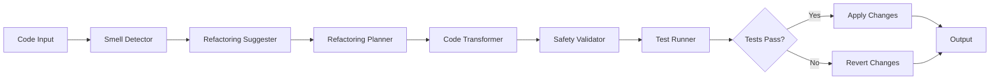

# Design Document

## Overview

The Refactoring Engine is an intelligent system that identifies code quality issues and applies safe, behavior-preserving transformations to improve code structure. It combines static analysis, pattern matching, and AI to suggest and apply refactorings while ensuring correctness through automated testing.

## Architecture



### Key Architectural Decisions

1. **Safety First**: Always validate refactorings with tests before committing
2. **Atomic Operations**: Each refactoring is applied atomically with rollback capability
3. **AST-Based**: Use Abstract Syntax Trees for precise code transformations
4. **Test-Driven Validation**: Rely on existing tests to verify behavior preservation
5. **Incremental Application**: Apply refactorings one at a time to isolate issues

## Components and Interfaces

### 1. Smell Detector

**Responsibility**: Identify code smells and refactoring opportunities

**Interface**:
```typescript
interface SmellDetector {
  detectLongMethods(code: string): LongMethodSmell[]
  detectDuplication(code: string): DuplicationSmell[]
  detectComplexConditionals(code: string): ConditionalSmell[]
  detectPoorNaming(code: string): NamingSmell[]
  detectSOLIDViolations(code: string): SOLIDSmell[]
}

interface CodeSmell {
  type: string
  location: Location
  severity: 'low' | 'medium' | 'high'
  description: string
  metrics?: Record<string, number>
}

interface LongMethodSmell extends CodeSmell {
  methodName: string
  lineCount: number
  extractableBlocks: CodeBlock[]
}

interface DuplicationSmell extends CodeSmell {
  instances: Location[]
  similarity: number
  extractionCandidate: string
}
```

### 2. Refactoring Suggester

**Responsibility**: Generate refactoring suggestions from detected smells

**Interface**:
```typescript
interface RefactoringSuggester {
  suggestRefactorings(smells: CodeSmell[]): RefactoringSuggestion[]
  suggestExtractMethod(smell: LongMethodSmell): ExtractMethodSuggestion
  suggestRemoveDuplication(smell: DuplicationSmell): RemoveDuplicationSuggestion
  suggestSimplifyConditional(smell: ConditionalSmell): SimplifyConditionalSuggestion
  suggestRename(smell: NamingSmell): RenameSuggestion
}

interface RefactoringSuggestion {
  id: string
  type: RefactoringType
  title: string
  description: string
  beforeCode: string
  afterCode: string
  diff: string
  benefits: string[]
  riskLevel: 'low' | 'medium' | 'high'
  estimatedEffort: 'low' | 'medium' | 'high'
  priority: number
}

type RefactoringType = 
  | 'extract_method'
  | 'remove_duplication'
  | 'simplify_conditional'
  | 'rename'
  | 'split_class'
  | 'introduce_interface'
```

### 3. Refactoring Planner

**Responsibility**: Plan the execution order and dependencies of refactorings

**Interface**:
```typescript
interface RefactoringPlanner {
  planRefactorings(suggestions: RefactoringSuggestion[]): RefactoringPlan
  identifyDependencies(suggestions: RefactoringSuggestion[]): Dependency[]
  orderRefactorings(suggestions: RefactoringSuggestion[]): RefactoringSuggestion[]
}

interface RefactoringPlan {
  refactorings: RefactoringSuggestion[]
  dependencies: Dependency[]
  estimatedDuration: number
}

interface Dependency {
  refactoringId: string
  dependsOn: string[]
  reason: string
}
```

### 4. Code Transformer

**Responsibility**: Apply refactorings to code using AST transformations

**Interface**:
```typescript
interface CodeTransformer {
  applyRefactoring(code: string, refactoring: RefactoringSuggestion): TransformResult
  extractMethod(code: string, block: CodeBlock, newName: string): TransformResult
  removeDuplication(code: string, instances: Location[], sharedMethod: string): TransformResult
  simplifyConditional(code: string, conditional: Location): TransformResult
  rename(code: string, oldName: string, newName: string, scope: Scope): TransformResult
}

interface TransformResult {
  success: boolean
  transformedCode: string
  changes: Change[]
  error?: string
}

interface Change {
  type: 'add' | 'remove' | 'modify'
  location: Location
  oldCode: string
  newCode: string
}
```

### 5. Safety Validator

**Responsibility**: Validate that refactorings are safe and behavior-preserving

**Interface**:
```typescript
interface SafetyValidator {
  validateRefactoring(original: string, refactored: string): ValidationResult
  checkSyntax(code: string): boolean
  checkNamingConflicts(code: string, newName: string): boolean
  checkBehaviorPreservation(original: string, refactored: string): Promise<boolean>
}

interface ValidationResult {
  safe: boolean
  issues: ValidationIssue[]
  warnings: string[]
}

interface ValidationIssue {
  type: 'syntax' | 'naming_conflict' | 'behavior_change'
  description: string
  location?: Location
}
```

### 6. Test Runner

**Responsibility**: Run tests to verify refactorings preserve behavior

**Interface**:
```typescript
interface TestRunner {
  runTests(codebase: string): Promise<TestResult>
  runSpecificTests(codebase: string, testFiles: string[]): Promise<TestResult>
  compareResults(before: TestResult, after: TestResult): boolean
}

interface TestResult {
  passed: number
  failed: number
  errors: TestError[]
  duration: number
}

interface TestError {
  testName: string
  error: string
  stackTrace: string
}
```

## Data Models

### Refactoring Model
```typescript
interface Refactoring {
  id: string
  projectId: string
  type: RefactoringType
  status: 'suggested' | 'applied' | 'reverted' | 'failed'
  beforeCode: string
  afterCode: string
  diff: string
  testsPassed: boolean
  appliedAt?: Date
  revertedAt?: Date
}
```

## Correctness Properties

*A property is a characteristic or behavior that should hold true across all valid executions of a system-essentially, a formal statement about what the system should do. Properties serve as the bridge between human-readable specifications and machine-verifiable correctness guarantees.*


### Property Reflection

After reviewing all testable properties, several can be consolidated:
- Properties 1.1, 1.2, 1.3, 1.4 (various smell detections) can be combined into smell detection completeness
- Properties 2.1, 2.2, 2.3, 2.4, 2.5 (suggestion elements) can be combined into suggestion completeness
- Properties 3.1, 3.2, 3.3, 3.4, 3.5 (extract method aspects) can be combined into extract method correctness
- Properties 4.1, 4.2, 4.3, 4.4, 4.5 (duplication removal aspects) can be combined into duplication removal correctness
- Properties 5.1, 5.2, 5.3, 5.4, 5.5 (conditional simplification aspects) can be combined into conditional simplification correctness
- Properties 6.1, 6.2, 6.3, 6.4, 6.5 (rename aspects) can be combined into rename correctness
- Properties 7.1, 7.2, 7.3, 7.4, 7.5 (SOLID aspects) can be combined into SOLID refactoring completeness
- Properties 8.1, 8.2, 8.3, 8.4, 8.5 (safety aspects) can be combined into refactoring safety

### Property 1: Smell detection completeness
*For any* codebase, all code smells should be detected including long methods, duplicate code, complex conditionals, and poorly named identifiers.
**Validates: Requirements 1.1, 1.2, 1.3, 1.4**

### Property 2: Refactoring prioritization
*For any* set of refactoring opportunities, they should be prioritized by impact and safety with high-impact, low-risk refactorings ranked highest.
**Validates: Requirements 1.5**

### Property 3: Suggestion completeness
*For any* refactoring suggestion, it should include before code, after code, a diff, benefits explanation, and a risk level estimate.
**Validates: Requirements 2.1, 2.2, 2.3, 2.4, 2.5**

### Property 4: Extract method correctness
*For any* extract method refactoring, it should correctly identify parameters, return values, suggest a descriptive name, and preserve the original behavior exactly.
**Validates: Requirements 3.1, 3.2, 3.3, 3.4, 3.5**

### Property 5: Duplication removal correctness
*For any* code duplication, the refactoring should identify all instances, handle variations, extract to a shared method, update all call sites, and verify tests still pass.
**Validates: Requirements 4.1, 4.2, 4.3, 4.4, 4.5**

### Property 6: Conditional simplification correctness
*For any* complex conditional, the refactoring should suggest appropriate simplifications (guard clauses, extracted variables, consolidation), preserve exact logical behavior, and verify results match the original.
**Validates: Requirements 5.1, 5.2, 5.3, 5.4, 5.5**

### Property 7: Rename correctness
*For any* rename refactoring, it should suggest descriptive names, update all references, handle scope correctly, and verify no naming conflicts are introduced.
**Validates: Requirements 6.1, 6.2, 6.3, 6.4, 6.5**

### Property 8: SOLID refactoring completeness
*For any* SOLID principle violation, appropriate refactorings should be suggested (split class, introduce interface, split interface), with explanations of which principle is addressed and effort estimates.
**Validates: Requirements 7.1, 7.2, 7.3, 7.4, 7.5**

### Property 9: Refactoring safety
*For any* applied refactoring, tests should be run to verify behavior preservation, changes should be reverted if tests fail, warnings should be issued when no tests exist, only safe refactorings should be suggested, and an undo mechanism should be available.
**Validates: Requirements 8.1, 8.2, 8.3, 8.4, 8.5**

## Error Handling

### Error Categories

1. **Transformation Errors**: Invalid AST transformations, syntax errors in generated code
2. **Test Failures**: Tests fail after refactoring, indicating behavior change
3. **Validation Errors**: Naming conflicts, scope issues, type errors
4. **System Errors**: Test runner failures, file system errors

### Error Handling Strategy

1. **Automatic Reversion**: Immediately revert changes if tests fail
2. **Validation Before Application**: Check for conflicts and issues before applying
3. **Atomic Operations**: Apply refactorings atomically with full rollback
4. **Detailed Error Reporting**: Explain why refactorings failed
5. **Safe Mode**: Option to only suggest refactorings without applying them

## Testing Strategy

### Unit Testing
- Test smell detection algorithms with various code patterns
- Test AST transformation logic
- Test parameter and return value identification
- Test naming conflict detection
- Test diff generation

### Property-Based Testing

Use fast-check for property-based testing. Each property test will run a minimum of 100 iterations.

**Property Test Requirements**:
- Tag format: `// Feature: refactoring-engine, Property X: [property description]`
- Each correctness property implemented by a single property-based test
- Use smart generators for code structures and refactoring scenarios

**Key Property Tests**:
1. Smell detection property (Property 1)
2. Prioritization property (Property 2)
3. Suggestion completeness property (Property 3)
4. Extract method property (Property 4)
5. Duplication removal property (Property 5)
6. Conditional simplification property (Property 6)
7. Rename property (Property 7)
8. SOLID refactoring property (Property 8)
9. Safety property (Property 9)

### Integration Testing
- Test complete refactoring pipeline with real codebases
- Test with various programming languages
- Test with existing test suites
- Verify behavior preservation across refactorings

## Implementation Notes

### Technology Stack
- **Runtime**: Node.js with TypeScript
- **AST Parsing**: Language-specific parsers (@babel/parser, tree-sitter, etc.)
- **AST Transformation**: jscodeshift, recast for JavaScript/TypeScript
- **Test Running**: Jest, pytest, JUnit runners
- **Diff Generation**: diff library
- **AI**: GPT-4 for naming suggestions and SOLID refactorings

### Refactoring Catalog

**Supported Refactorings**:
1. Extract Method
2. Inline Method
3. Rename Variable/Method/Class
4. Remove Duplication
5. Simplify Conditional
6. Introduce Guard Clause
7. Extract Variable
8. Split Class
9. Introduce Interface
10. Move Method

### Safety Guarantees

1. **Test-Driven**: Always run tests before and after
2. **Atomic**: All-or-nothing application
3. **Reversible**: Every refactoring can be undone
4. **Validated**: Check for conflicts before applying
5. **Incremental**: Apply one refactoring at a time

### Performance Optimizations
- Cache AST parsing results
- Parallel smell detection across files
- Incremental analysis for changed files only
- Smart test selection (only run affected tests)
