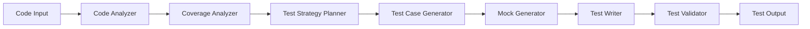

# Design Document

## Overview

The Test Generator is an AI-powered system that automatically creates comprehensive unit tests for legacy code. It analyzes code structure, behavior, and dependencies to generate test suites covering happy paths, edge cases, and error conditions. The system uses both static analysis and AI to create maintainable, well-structured tests.

## Architecture



### Key Architectural Decisions

1. **Hybrid Approach**: Combine static analysis for structure with AI for test logic generation
2. **Strategy-First**: Plan test strategy before generating individual tests
3. **Framework-Agnostic Core**: Abstract test generation logic from specific testing frameworks
4. **Validation Loop**: Validate generated tests can compile and run
5. **Incremental Generation**: Generate tests file-by-file to manage complexity

## Components and Interfaces

### 1. Code Analyzer

**Responsibility**: Analyze code to extract testable units and their characteristics

**Interface**:
```typescript
interface CodeAnalyzer {
  analyzeFunction(func: FunctionInfo): FunctionAnalysis
  analyzeClass(cls: ClassInfo): ClassAnalysis
  identifyDependencies(code: string): Dependency[]
  identifyErrorPaths(func: FunctionInfo): ErrorPath[]
}

interface FunctionAnalysis {
  name: string
  parameters: ParameterInfo[]
  returnType: string | null
  hasErrorHandling: boolean
  errorPaths: ErrorPath[]
  dependencies: Dependency[]
  complexity: number
  sideEffects: SideEffect[]
}

interface ClassAnalysis {
  name: string
  constructor: FunctionInfo | null
  publicMethods: FunctionInfo[]
  privateMethod: FunctionInfo[]
  properties: PropertyInfo[]
  hasState: boolean
  inheritance: string | null
}

interface ErrorPath {
  condition: string
  exceptionType: string | null
  errorMessage: string | null
}
```

### 2. Coverage Analyzer

**Responsibility**: Analyze existing test coverage and identify gaps

**Interface**:
```typescript
interface CoverageAnalyzer {
  analyzeCurrentCoverage(codebase: string): CoverageReport
  identifyUntestedCode(codebase: string): UntestedCode[]
  calculateCoverageGaps(existing: TestSuite[], code: string): CoverageGap[]
  prioritizeUntestedCode(untested: UntestedCode[]): PrioritizedCode[]
}

interface CoverageReport {
  overallPercentage: number
  byFile: Map<string, number>
  untestedFunctions: string[]
  untestedClasses: string[]
  criticalPathsCovered: boolean
}

interface UntestedCode {
  type: 'function' | 'class' | 'module'
  name: string
  file: string
  complexity: number
  priority: 'critical' | 'high' | 'medium' | 'low'
}

interface CoverageGap {
  type: 'edge_case' | 'error_path' | 'branch'
  description: string
  location: string
  estimatedImpact: number
}
```

### 3. Test Strategy Planner

**Responsibility**: Plan comprehensive test strategy for code units

**Interface**:
```typescript
interface TestStrategyPlanner {
  planFunctionTests(analysis: FunctionAnalysis): TestStrategy
  planClassTests(analysis: ClassAnalysis): TestStrategy
  identifyTestCases(analysis: FunctionAnalysis): TestCase[]
  identifyEdgeCases(parameters: ParameterInfo[]): EdgeCase[]
}

interface TestStrategy {
  targetCode: string
  testCases: TestCase[]
  edgeCases: EdgeCase[]
  errorCases: ErrorCase[]
  mockingStrategy: MockingStrategy
  setupRequired: string[]
  teardownRequired: string[]
}

interface TestCase {
  name: string
  description: string
  inputs: any[]
  expectedOutput: any
  type: 'happy_path' | 'edge_case' | 'error_case'
}

interface EdgeCase {
  parameter: string
  value: any
  reason: string
}

interface ErrorCase {
  scenario: string
  expectedError: string
  errorMessage?: string
}
```

### 4. Test Case Generator

**Responsibility**: Generate specific test cases using AI

**Interface**:
```typescript
interface TestCaseGenerator {
  generateHappyPathTests(func: FunctionAnalysis): TestCase[]
  generateEdgeCaseTests(func: FunctionAnalysis): TestCase[]
  generateErrorTests(func: FunctionAnalysis): TestCase[]
  generateClassTests(cls: ClassAnalysis): TestCase[]
}
```

### 5. Mock Generator

**Responsibility**: Generate mocks for external dependencies

**Interface**:
```typescript
interface MockGenerator {
  generateMocks(dependencies: Dependency[]): Mock[]
  generateDatabaseMock(dbCalls: DatabaseCall[]): Mock
  generateAPIMock(apiCalls: APICall[]): Mock
  generateFileSystemMock(fileOps: FileOperation[]): Mock
}

interface Mock {
  target: string
  mockCode: string
  mockLibrary: string
  setupCode: string
}
```

### 6. Test Writer

**Responsibility**: Write test code in the appropriate framework

**Interface**:
```typescript
interface TestWriter {
  writeTestSuite(strategy: TestStrategy, framework: TestFramework): string
  writeTestCase(testCase: TestCase, framework: TestFramework): string
  writeSetup(setup: string[], framework: TestFramework): string
  writeTeardown(teardown: string[], framework: TestFramework): string
  formatTest(code: string, style: CodeStyle): string
}

type TestFramework = 'jest' | 'mocha' | 'pytest' | 'junit' | 'rspec'
```

### 7. Test Validator

**Responsibility**: Validate generated tests can compile and run

**Interface**:
```typescript
interface TestValidator {
  validateSyntax(testCode: string, language: string): ValidationResult
  validateImports(testCode: string, codebase: string): ValidationResult
  attemptCompilation(testCode: string): ValidationResult
  suggestFixes(errors: ValidationError[]): Fix[]
}

interface ValidationResult {
  valid: boolean
  errors: ValidationError[]
  warnings: ValidationWarning[]
}
```

## Data Models

### Test Suite Model
```typescript
interface TestSuite {
  id: string
  projectId: string
  targetFile: string
  framework: TestFramework
  testCode: string
  testCases: TestCase[]
  mocks: Mock[]
  coverageImprovement: number
  status: 'generated' | 'validated' | 'failed'
  createdAt: Date
}
```

## Correctness Properties

*A property is a characteristic or behavior that should hold true across all valid executions of a system-essentially, a formal statement about what the system should do. Properties serve as the bridge between human-readable specifications and machine-verifiable correctness guarantees.*


### Property Reflection

After reviewing all testable properties, several can be consolidated:
- Properties 1.1, 1.2, 1.3 (happy path, inputs, assertions) can be combined into basic test generation completeness
- Properties 2.1, 2.2, 2.3, 2.4, 2.5 (various edge cases) can be combined into edge case coverage
- Properties 3.1, 3.2, 3.3, 3.4, 3.5 (various error scenarios) can be combined into error path coverage
- Properties 4.1, 4.2, 4.3, 4.4, 4.5 (class testing aspects) can be combined into class test completeness
- Properties 5.1, 5.2, 5.3, 5.4, 5.5 (various mocking scenarios) can be combined into mocking completeness
- Properties 6.1, 6.2, 6.3, 6.4, 6.5 (coverage analysis aspects) can be combined into coverage analysis completeness
- Properties 7.1, 7.2, 7.3, 7.4, 7.5 (coverage improvement aspects) can be combined into improvement suggestion completeness
- Properties 8.1, 8.2, 8.3, 8.4 (maintainability aspects) can be combined into test maintainability

### Property 1: Basic test generation completeness
*For any* function, at least one happy path test should be generated with varied input values and assertions verifying the return value.
**Validates: Requirements 1.1, 1.2, 1.3**

### Property 2: Framework appropriateness
*For any* language, tests should be generated using the appropriate testing framework for that language.
**Validates: Requirements 1.4**

### Property 3: Descriptive test naming
*For any* generated test, the test name should describe the behavior being tested.
**Validates: Requirements 1.5**

### Property 4: Edge case coverage
*For any* function with parameters, appropriate edge case tests should be generated including: zero/negative/boundary values for numbers, empty strings/special characters for strings, empty/single-element arrays, and null/undefined for nullable parameters.
**Validates: Requirements 2.1, 2.2, 2.3, 2.4, 2.5**

### Property 5: Error path coverage
*For any* function with error handling, tests should be generated that trigger error paths, test invalid inputs, assert expected exceptions, cover both success and failure paths in try-catch blocks, and verify error messages.
**Validates: Requirements 3.1, 3.2, 3.3, 3.4, 3.5**

### Property 6: Class test completeness
*For any* class, tests should be generated for all public methods, constructor initialization, state changes, inherited behavior, and include appropriate setup/teardown fixtures.
**Validates: Requirements 4.1, 4.2, 4.3, 4.4, 4.5**

### Property 7: Mocking completeness
*For any* code with external dependencies (database, API, file system), appropriate mocks should be generated using the correct mocking library for the language and framework.
**Validates: Requirements 5.1, 5.2, 5.3, 5.4, 5.5**

### Property 8: Coverage analysis completeness
*For any* codebase, the analysis should identify untested functions, calculate coverage percentage, prioritize untested code by complexity, flag critical paths, and report zero-coverage files.
**Validates: Requirements 6.1, 6.2, 6.3, 6.4, 6.5**

### Property 9: Improvement suggestion completeness
*For any* codebase with existing tests, coverage gaps should be identified, suggestions should be made for missing edge cases and error paths, coverage improvement should be estimated, and suggestions should be prioritized by impact.
**Validates: Requirements 7.1, 7.2, 7.3, 7.4, 7.5**

### Property 10: Test maintainability
*For any* generated test suite, tests should have clear descriptive names, include comments for complex scenarios, be organized logically, and follow project conventions.
**Validates: Requirements 8.1, 8.2, 8.3, 8.4**

## Error Handling

### Error Categories

1. **Code Analysis Errors**: Unparseable code, unsupported language features
2. **Test Generation Errors**: AI generation failures, invalid test syntax
3. **Validation Errors**: Tests that don't compile, missing imports
4. **Framework Errors**: Unsupported testing framework, missing dependencies

### Error Handling Strategy

1. **Graceful Degradation**: Generate simpler tests if complex scenarios fail
2. **Partial Generation**: Save successfully generated tests even if some fail
3. **Validation Loop**: Attempt to fix common issues automatically
4. **Clear Reporting**: Explain which tests couldn't be generated and why

## Testing Strategy

### Unit Testing
- Test code analysis logic with various function/class structures
- Test edge case identification algorithms
- Test mock generation logic
- Test framework-specific code generation

### Property-Based Testing

Use fast-check for property-based testing. Each property test will run a minimum of 100 iterations.

**Property Test Requirements**:
- Tag format: `// Feature: test-generator, Property X: [property description]`
- Each correctness property implemented by a single property-based test
- Use smart generators for functions, classes, and code structures

## Implementation Notes

### Technology Stack
- **Runtime**: Node.js with TypeScript
- **AI Models**: GPT-4 for test logic generation
- **Code Parsing**: Language-specific AST parsers
- **Testing Frameworks**: Jest, pytest, JUnit, RSpec
- **Mocking Libraries**: jest.mock, unittest.mock, Mockito, RSpec mocks
- **Coverage Analysis**: Istanbul, coverage.py, JaCoCo

### Test Generation Approach

1. **Static Analysis First**: Extract structure and dependencies
2. **Strategy Planning**: Decide what to test before generating
3. **AI-Assisted Generation**: Use AI to generate test logic and assertions
4. **Validation**: Compile and validate generated tests
5. **Iteration**: Fix issues and regenerate if needed

### Performance Optimizations
- Cache code analysis results
- Generate tests in parallel for multiple files
- Reuse mock templates for common dependencies
- Batch AI requests for multiple test cases
