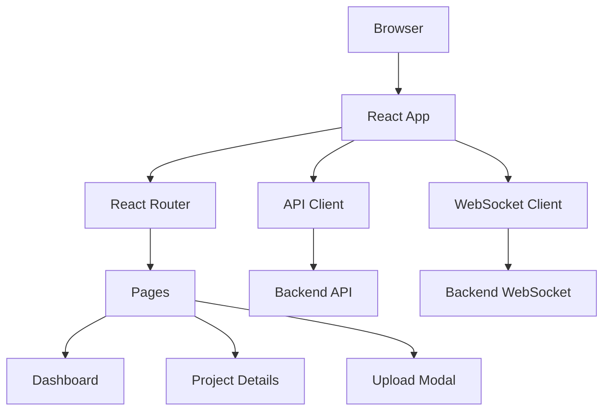

# Design Document - Web UI

## Overview

The Web UI is a modern, responsive React application that provides an intuitive interface for the Legacy Code Revival AI system. It uses React with TypeScript, Tailwind CSS for styling, and integrates with the backend API for all operations.

## Technology Stack

- **Framework**: React 18 with TypeScript
- **Styling**: Tailwind CSS + shadcn/ui components
- **State Management**: React Query (TanStack Query) for server state
- **Routing**: React Router v6
- **Charts**: Recharts for data visualization
- **Forms**: React Hook Form with Zod validation
- **HTTP Client**: Axios
- **Real-time**: Socket.io-client for progress updates
- **Build Tool**: Vite

## Architecture



## Project Structure

```
frontend/
├── public/
│   └── favicon.ico
├── src/
│   ├── components/
│   │   ├── ui/              # shadcn/ui components
│   │   ├── Dashboard/
│   │   ├── ProjectCard/
│   │   ├── UploadModal/
│   │   ├── AnalysisView/
│   │   ├── ProgressTracker/
│   │   └── Charts/
│   ├── pages/
│   │   ├── HomePage.tsx
│   │   ├── ProjectPage.tsx
│   │   └── NotFoundPage.tsx
│   ├── api/
│   │   ├── client.ts
│   │   └── endpoints.ts
│   ├── hooks/
│   │   ├── useProjects.ts
│   │   ├── useAnalysis.ts
│   │   └── useWebSocket.ts
│   ├── types/
│   │   └── index.ts
│   ├── utils/
│   │   └── formatters.ts
│   ├── App.tsx
│   └── main.tsx
├── package.json
├── tsconfig.json
├── vite.config.ts
└── tailwind.config.js
```

## Key Components

### 1. Dashboard Component

**Responsibility**: Display all projects with filtering and sorting

**Features**:
- Grid layout of project cards
- Filter by status (All, Pending, Analyzing, Completed, Failed)
- Sort by date, name, status
- Search by project name
- "New Analysis" button
- Summary statistics

### 2. Upload Modal Component

**Responsibility**: Handle codebase upload from multiple sources

**Features**:
- Tab interface for source selection (GitHub, ZIP, Local)
- GitHub URL input with validation
- File upload with drag-and-drop
- Progress bar for uploads
- Size validation (100MB limit)
- Error handling and validation messages

### 3. Project Card Component

**Responsibility**: Display project summary and status

**Features**:
- Project name and source type icon
- Status badge with color coding
- Timestamp (created/updated)
- Quick actions (View, Delete)
- Progress indicator for analyzing projects

### 4. Analysis View Component

**Responsibility**: Display detailed analysis results

**Features**:
- Tabbed interface (Overview, Languages, Dependencies, Metrics, Issues)
- Language distribution chart
- Metrics dashboard with gauges
- Dependency list with versions
- Issue list with filtering
- Download report button

### 5. Progress Tracker Component

**Responsibility**: Show real-time analysis progress

**Features**:
- Progress bar (0-100%)
- Current stage indicator
- Stage list with checkmarks
- Estimated time remaining
- Cancel button

### 6. Charts Components

**Responsibility**: Visualize analysis data

**Components**:
- LanguagePieChart
- MetricsGauge
- ComplexityBarChart
- IssuesSeverityChart

## Pages

### Home Page (`/`)

**Layout**:
```
┌─────────────────────────────────────┐
│ Header: Logo | Search | New Analysis│
├─────────────────────────────────────┤
│ Filters: [All][Analyzing][Complete] │
│ Sort: [Date ▼]                      │
├─────────────────────────────────────┤
│ ┌──────┐ ┌──────┐ ┌──────┐         │
│ │Card 1│ │Card 2│ │Card 3│         │
│ └──────┘ └──────┘ └──────┘         │
│ ┌──────┐ ┌──────┐ ┌──────┐         │
│ │Card 4│ │Card 5│ │Card 6│         │
│ └──────┘ └──────┘ └──────┘         │
└─────────────────────────────────────┘
```

### Project Details Page (`/project/:id`)

**Layout**:
```
┌─────────────────────────────────────┐
│ ← Back | Project Name | [Download]  │
├─────────────────────────────────────┤
│ [Overview][Languages][Deps][Issues] │
├─────────────────────────────────────┤
│                                     │
│  Analysis Results Content           │
│  - Charts                           │
│  - Tables                           │
│  - Metrics                          │
│                                     │
└─────────────────────────────────────┘
```

## API Integration

### API Client (`src/api/client.ts`)

```typescript
import axios from 'axios';

const apiClient = axios.create({
  baseURL: import.meta.env.VITE_API_URL || 'http://localhost:3000/api',
  timeout: 30000,
});

export default apiClient;
```

### API Endpoints (`src/api/endpoints.ts`)

```typescript
export const projectsAPI = {
  getAll: () => apiClient.get('/projects'),
  getById: (id: string) => apiClient.get(`/projects/${id}`),
  create: (data: CreateProjectDTO) => apiClient.post('/analyze', data),
  delete: (id: string) => apiClient.delete(`/projects/${id}`),
};

export const analysisAPI = {
  getStatus: (id: string) => apiClient.get(`/analysis/${id}`),
  getReport: (id: string) => apiClient.get(`/report/${id}`),
  downloadReport: (id: string, format: string) => 
    apiClient.get(`/report/${id}/download?format=${format}`, { responseType: 'blob' }),
};
```

## State Management

### React Query Hooks

```typescript
// useProjects.ts
export function useProjects() {
  return useQuery({
    queryKey: ['projects'],
    queryFn: () => projectsAPI.getAll(),
    refetchInterval: 5000, // Poll every 5 seconds
  });
}

// useProject.ts
export function useProject(id: string) {
  return useQuery({
    queryKey: ['project', id],
    queryFn: () => projectsAPI.getById(id),
  });
}

// useCreateProject.ts
export function useCreateProject() {
  const queryClient = useQueryClient();
  
  return useMutation({
    mutationFn: projectsAPI.create,
    onSuccess: () => {
      queryClient.invalidateQueries({ queryKey: ['projects'] });
    },
  });
}
```

## Real-time Updates

### WebSocket Hook

```typescript
// useWebSocket.ts
export function useWebSocket(projectId: string) {
  const [progress, setProgress] = useState(0);
  const [stage, setStage] = useState('');

  useEffect(() => {
    const socket = io(import.meta.env.VITE_WS_URL || 'http://localhost:3000');
    
    socket.emit('subscribe', projectId);
    
    socket.on('progress', (data) => {
      setProgress(data.progress);
      setStage(data.stage);
    });

    return () => {
      socket.disconnect();
    };
  }, [projectId]);

  return { progress, stage };
}
```

## Styling

### Tailwind Configuration

```javascript
// tailwind.config.js
module.exports = {
  content: ['./index.html', './src/**/*.{js,ts,jsx,tsx}'],
  theme: {
    extend: {
      colors: {
        primary: '#3b82f6',
        success: '#10b981',
        warning: '#f59e0b',
        danger: '#ef4444',
      },
    },
  },
  plugins: [],
};
```

### Component Library

Using **shadcn/ui** for pre-built, accessible components:
- Button
- Card
- Dialog (Modal)
- Tabs
- Badge
- Progress
- Table
- Select
- Input

## Responsive Design

### Breakpoints

- Mobile: < 640px
- Tablet: 640px - 1024px
- Desktop: > 1024px

### Mobile Adaptations

- Stack project cards vertically
- Collapse filters into dropdown
- Simplify charts for small screens
- Touch-friendly buttons (min 44px)

## Error Handling

### Error Boundary

```typescript
class ErrorBoundary extends React.Component {
  componentDidCatch(error, errorInfo) {
    // Log to error tracking service
    console.error('Error:', error, errorInfo);
  }

  render() {
    if (this.state.hasError) {
      return <ErrorFallback />;
    }
    return this.props.children;
  }
}
```

### Toast Notifications

Using **react-hot-toast** for user feedback:
- Success messages (green)
- Error messages (red)
- Info messages (blue)
- Loading states

## Performance Optimization

1. **Code Splitting**: Lazy load pages and heavy components
2. **Image Optimization**: Use WebP format, lazy loading
3. **Caching**: React Query caching for API responses
4. **Debouncing**: Search and filter inputs
5. **Virtual Scrolling**: For large lists of projects

## Accessibility

- Semantic HTML elements
- ARIA labels and roles
- Keyboard navigation support
- Focus management
- Screen reader friendly
- Color contrast compliance (WCAG AA)

## Testing Strategy

- **Unit Tests**: Jest + React Testing Library
- **Integration Tests**: Test user flows
- **E2E Tests**: Playwright for critical paths
- **Visual Tests**: Storybook for component library

## Deployment

- **Build**: `npm run build`
- **Preview**: `npm run preview`
- **Deploy**: Static hosting (Vercel, Netlify, AWS S3)
- **Environment Variables**: `.env.production`

## Implementation Plan

1. Set up Vite + React + TypeScript project
2. Install and configure Tailwind CSS + shadcn/ui
3. Create basic routing structure
4. Implement API client and hooks
5. Build Dashboard page with project cards
6. Build Upload Modal component
7. Build Project Details page
8. Add charts and visualizations
9. Implement real-time progress tracking
10. Add error handling and loading states
11. Optimize for mobile responsiveness
12. Add tests
13. Deploy to production
